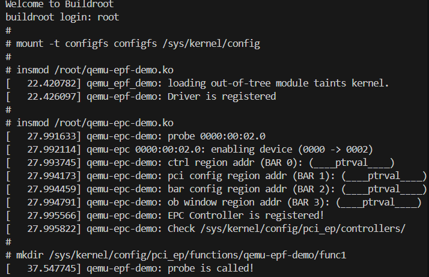
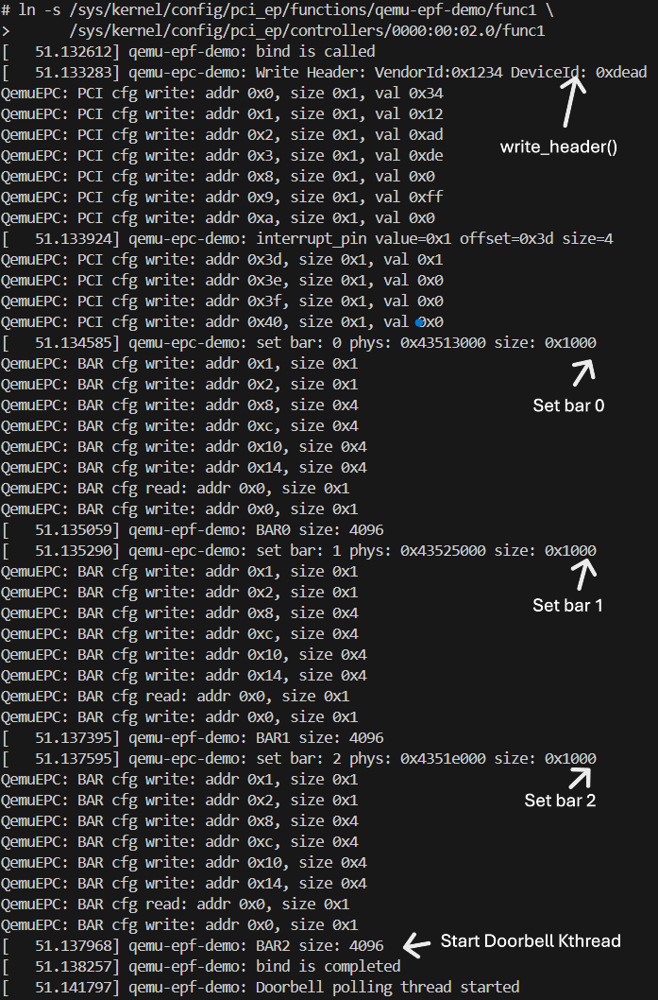
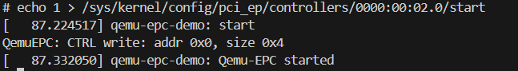
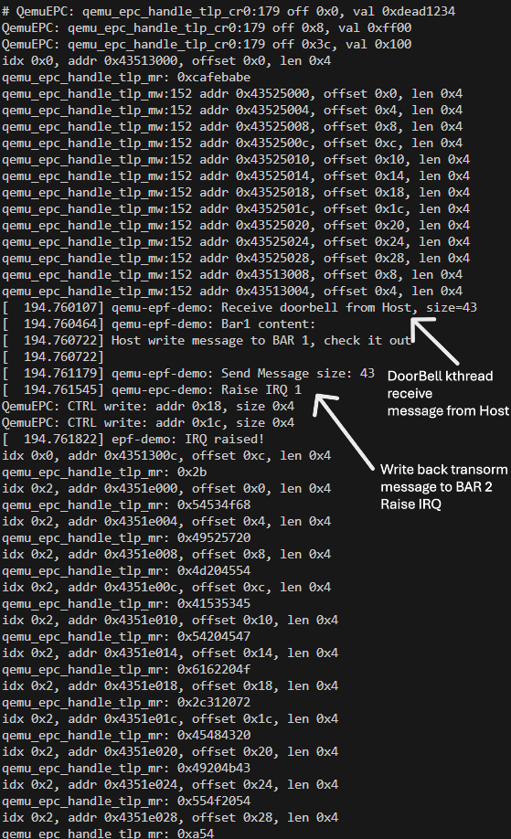
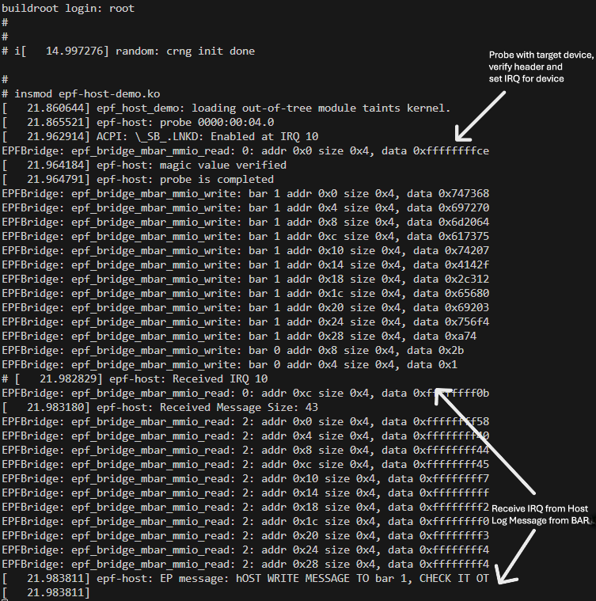

# PCIe Endpoint Function Demo
### Bidirectional Shared Buffer over QEMU Virtual PCIe

---

## 1. Overview

This demo implements a bidirectional shared buffer communication channel between a Host and an Endpoint (EP) device over a QEMU-simulated PCIe bus. The EP advertises itself as a custom PCI device (Vendor ID `0x1234`, Device ID `0xDEAD`) and exposes three Base Address Registers (BARs) to the host. The demo application performs case inversion: the host sends a string to the EP, and the EP returns the string with uppercase and lowercase letters swapped.

### 1.1 Architecture

The system consists of four components running across two virtual machines connected by a QEMU-emulated PCIe bus:

| Component | Location | Role |
|-----------|----------|------|
| `elton-host-demo.ko` | Host VM | Standard PCI driver. Maps BARs, sends data via BAR1, reads EP response from BAR2 via IRQ handler. |
| `qemu-epf-demo.ko` | EP VM | EPF function driver. Allocates BAR buffers, polls doorbell, performs case inversion, raises IRQ. |
| `qemu-epc.ko` | EP VM | EPC controller driver. Bridges the Linux `pci_epc` framework to the QEMU virtual hardware via MMIO registers. |
| `epf-bridge` (QEMU) | QEMU | Virtual PCIe hardware. Translates MMIO writes into TLP packets and forwards them between the two VMs via a Unix socket. |

### 1.2 Communication Flow

The end-to-end flow for a single request/response cycle:

```
Host probe
  1. Host copies message into padded buffer
  2. memcpy_toio(BAR1, padded_buf, ALIGN(len, 4))   [TLP MW to EP]
  3. writel(len, BAR0 + HOST_SIZE)                  [TLP MW to EP]
  4. writel(1,   BAR0 + REG_DOORBELL)               [TLP MW to EP]

EP kthread (polling every 5ms)
  5. readl(BAR0 + REG_DOORBELL) == 1 -> process request
  6. Read message from bar_buf[1]  (direct RAM access, no TLP)
  7. Perform case inversion into alphaBuf
  8. writel(size, bar_buf[0] + BAR0_EP_SIZE)
  9. memcpy_toio(bar_buf[2], alphaBuf, ALIGN(size, 4))
 10. writel(0, bar_buf[0] + REG_DOORBELL)           <- clear doorbell
 11. pci_epc_raise_irq(PCI_EPC_IRQ_LEGACY, 1)       [TLP MSG INTA]

Host IRQ handler
 12. readl(BAR0 + EP_SIZE) -> size
 13. memcpy_fromio(buffer, BAR2, ALIGN(size, 4))    [TLP MR from EP]
 14. pr_info("EP message: %s", buffer)
```

> **Note:** All writes to host-side BAR mappings (`priv->bar0/1/2`) travel over the PCIe bus as TLP packets. On the EP side, `bar_buf[]` is ordinary kernel RAM allocated by `pci_epf_alloc_space()` and can be accessed directly via pointer.

### 1.3 BAR Layout

| BAR | Size | Direction | Purpose |
|-----|------|-----------|---------|
| BAR0 | 4 KB | Read/Write | Control registers: `REG_MAGIC` (0x00), `REG_DOORBELL` (0x04), `HOST_SIZE` (0x08), `EP_SIZE` (0x0C) |
| BAR1 | 4 KB | Host → EP | Data buffer: host writes message here before ringing doorbell |
| BAR2 | 4 KB | EP → Host | Response buffer: EP writes processed result here before raising IRQ |

---

## 2. Code Structure

### 2.1 `qemu-host-demo.ko` — Host PCI Driver

A standard Linux PCI driver that runs on the host VM. It is matched to the EP device by Vendor/Device ID (`0x1234:0xDEAD`) and handles the host side of the communication protocol.

**Key functions:**

| Function | Description |
|----------|-------------|
| `epf_host_probe()` | Enables device, requests regions, maps BAR0/1/2 via `pcim_iomap()`, registers IRQ handler, verifies magic value (`0xcafebabe`), then sends the initial test message to the EP. |
| `epf_host_irq_handler()` | Fires when EP raises a legacy IRQ. Reads `EP_SIZE` from BAR0, allocates a kernel buffer with `GFP_ATOMIC`, reads the EP response from BAR2 via `memcpy_fromio()`, and prints it. |
| `epf_host_remove()` | Frees IRQ, releases PCI regions, disables device. |

**MMIO access rule:**
Host-side BARs are MMIO mappings. All reads must use `readl()`/`ioread32()` for single registers or `memcpy_fromio()` for bulk data. All writes must use `writel()`/`iowrite32()` or `memcpy_toio()`. Direct pointer casts are undefined behavior on MMIO memory.

**DWORD alignment requirement:**
The QEMU `epf-bridge` encodes write length in the TLP header as `length >> 2` (DWORDs). Sub-4-byte writes produce a TLP with `length=0`, corrupting the socket stream. All `memcpy_toio()` calls must use `ALIGN(len, 4)` and write from a zero-padded buffer to avoid reading past the source buffer end.

---

### 2.2 `qemu-epf-demo.ko` — EP Function Driver

The EPF (Endpoint Function) driver runs on the EP VM and implements the application logic of the demo device. This layer is hardware-independent — it only interacts with the `pci_epf` framework abstractions and would work unchanged on real PCIe hardware with a different EPC driver.

**Key functions:**

| Function | Description |
|----------|-------------|
| `epf_demo_probe()` | Called when the EPF device is created via configfs. Allocates the `epf_demo` private struct and stores it as driver data. |
| `epf_demo_bind()` | Called when the EPF is linked to an EPC controller. Allocates 4 KB BAR buffers via `pci_epf_alloc_space()`, writes the PCI config space header, configures all three BARs via `pci_epc_set_bar()`, writes magic value `0xcafebabe` into BAR0, and starts the doorbell polling kthread. |
| `epf_demo_unbind()` | Stops the kthread, clears all BARs, and frees BAR buffers. |
| `epf_demo_thread()` | Kthread polling BAR0 doorbell register every 5 ms. When doorbell == 1, calls `handle_host_request()`, clears the doorbell, then raises a legacy IRQ via `pci_epc_raise_irq()`. |
| `handle_host_request()` | Reads `HOST_SIZE` from BAR0, reads the message from `bar_buf[1]` (direct RAM access), performs case inversion into a `kmalloc`'d buffer, writes `EP_SIZE` to BAR0, and copies the result to `bar_buf[2]` via `memcpy_toio()`. |

**EP vs Host memory access:**
Unlike the host driver, the EP accesses `bar_buf[]` directly via pointer because `pci_epf_alloc_space()` returns a normal kernel virtual address backed by real RAM. TLPs from the host land in this RAM via DMA — no special accessors are needed on the EP side.

---

### 2.3 `qemu-epc.ko` — EPC Controller Driver

The EPC (Endpoint Controller) driver runs on the EP VM and sits between the EPF framework and the QEMU virtual PCIe hardware. It translates `pci_epc_ops` callbacks into MMIO writes to the QEMU EPC device's control registers. On real hardware, this layer would be replaced by a vendor-provided EPC driver (e.g. Designware, Cadence) — the EPF driver above would remain unchanged.

**QEMU EPC BAR layout (internal, not visible to host):**

| BAR | Name | Purpose |
|-----|------|---------|
| BAR0 | `CTRL` | Start/stop EPC, IRQ type/number, outbound window map configuration |
| BAR1 | `PCI_CFG` | PCI configuration space mirror — written by `write_header()` |
| BAR2 | `BAR_CFG` | BAR configuration registers — written by `set_bar()` to tell QEMU where each EPF BAR's physical memory lives |
| BAR3 | `OB_WIN` | Outbound window — used for EP-initiated DMA to host memory |

**Key `pci_epc_ops` implemented:**

| Callback | Implementation |
|----------|----------------|
| `qemu_epc_write_header()` | Writes vendor ID, device ID, revision, class code, and interrupt pin into the `PCI_CFG` BAR via `memcpy_toio()`. |
| `qemu_epc_set_bar()` | Writes bar number (1 byte), flags (1 byte), physical address (8 bytes), and size (8 bytes) into the `BAR_CFG` region. Writes the mask register last as a commit trigger. |
| `qemu_epc_raise_irq()` | Writes IRQ type then interrupt number to the `CTRL` region. Writing interrupt number triggers QEMU to send a TLP MSG (INTA assertion) to the host. |
| `qemu_epc_start()` | Writes 1 to `CTRL_OFF_START`. QEMU spawns a thread that listens on a Unix socket for TLP messages from `epf-bridge`. |

**`set_bar()` write width requirement:**
The BAR number and flags registers are 1-byte fields at offsets `0x01` and `0x02`. They must be written with `writeb()` not `writel()`. Writing 4 bytes to offset `0x02` spills into reserved offsets `0x03–0x05` and corrupts the BAR configuration for subsequent BARs.

## How to run

### Tools Requirement
* Linux 6.1.166 
* Qemu 6.2.0 + Backport Commit
* Backport Qemu Virtual PCIE Commit — adds virtual PCIe endpoint controller device to QEMU
  (Ref: https://marc.info/?l=qemu-devel&m=169573607526366)
* Buildroot
* `qemu-epf-demo.ko` + `qemu-epc-demo.ko` for Endpoint (ARM), `epf-host-demo.ko` for Host (x86)

### Linux 6.1 Kernel

```bash
# 1. Build tool  
sudo apt install -y build-essential gcc \
make bc flex bison libssl-dev libelf-dev \
libncurses-dev pahole

# 2. Fetch the Linux 6.1.166 (include all bug-fix)  
wget https://cdn.kernel.org/pub/linux/kernel/v6.x/linux-6.1.166.tar.xz
# Unzip 
tar -xf linux-6.1.166.tar.xz

# 3. Generate .config and build the Linux Image  
# x86  
make defconfig && make -j$(nproc)  
# arm 
make ARCH=arm64 CROSS_COMPILE=aarch64-linux-gnu- O=../linux-arm64-build defconfig
make ARCH=arm64 CROSS_COMPILE=aarch64-linux-gnu- O=../linux-arm64-build -j$(nproc)
```


### QEMU

``` bash
# 1. Download Qemu-6.2.0 zip
wget https://download.qemu.org/qemu-6.2.0.tar.xz

# 2. Install dependencies (Ubuntu/Debian)
sudo apt update
sudo apt install -y git libglib2.0-dev libfdt-dev libpixman-1-dev zlib1g-dev \
  ninja-build build-essential python3 python3-pip libslirp-dev

# 3 Extract & Condigure the Qemu-6.2.0
tar xf qemu-6.2.0.tar.xz
cd qemu-6.2.0
mkdir build && cd build

# 4. Run configure from inside build/
../qemu-6.2.0/configure --target-list=x86_64-softmmu,aarch64-softmmu
make -j$(nproc)

```

### Buildroot

```bash
# Build rootfs with buildroot (both aarch and x86)

# 1. Clone Buildroot
git clone --depth=1 https://github.com/buildroot/buildroot.git

# 2. Configure Buildroot for both ARM and x86
# Inside the menu, select ext4 as filesystem format
# Also set a larger size for the filesystem size
# Unselect all other option:
#    - Linux Kernel
#    - Host Uitlity

# x86
make O=output-x86 qemu_x86_64_defconfig
make O=output-x86 menuconfig
make O=output-x86 -j$(nproc) 

# ARM
make O=output-arm qemu_aarch64_virt_defconfig
make O=output-arm menuconfig
make O=output-arm -j$(nproc)

```

### Driver Installation
``` bash
# Compile the EPC EPF driver
# copy it into output/target/root/ (aarch64) and output-x86/target/root/ (x86)
# make the rootfs again
cp qemu-epf-demo.ko ~/pcie-demo/br/buildroot/output/target/root/
cp qemu-epc-demo.ko ~/pcie-demo/br/buildroot/output/target/root/

cp epf-host-demo.ko ~/pcie-demo/br/buildroot/output-x86/target/root/

# inside the buildroot folder, build the filesystem again
make O=output -j$(nproc) 
make O=output-x86 -j$(nproc)
```


## Code Execution Flow
- Sequence : First Set up Endpoint(ARM), then run Host(x86)

### 1. Endpoint (ARM)
```bash
# Run Endpoint
> ~/pcie-demo/qemu-src/build/qemu-system-aarch64 \
    -machine virt \
    -cpu cortex-a57 \
    -kernel ~/pcie-demo/linux-source/linux-arm64-build/arch/arm64/boot/Image \
    -drive file=~/pcie-demo/br/buildroot/output/images/rootfs.ext4,format=raw \
    -m 2G \
    -append "root=/dev/vda console=ttyAMA0 rw" \
    -nographic \
    -device qemu-epc

# 1. Mount configfs: For userspace creating and linking EPC EPF
> mount -t configfs configfs /sys/kernel/config

# 2. Load both driver
> insmod /root/qemu-epf-demo.ko

[   13.473434] qemu_epf_demo: loading out-of-tree module taints kernel.
[   13.478579] qemu-epf-demo: driver registered

> insmod /root/qemu-epc-demo.ko

[   21.945494] qemu-epc-demo: probe 0000:00:02.0
[   21.945800] qemu-epc 0000:00:02.0: enabling device (0000 -> 0002)
[   21.947140] qemu-epc-demo: ctrl=(____ptrval____) pci_cfg=(____ptrval____) bar_cfg=(____ptrval____) ob_window=(____ptrval____)
[   21.949019] qemu-epc-demo: EPC controller registered!
[   21.949286] qemu-epc-demo: check /sys/kernel/config/pci_ep/controllers/


# 3. Create EPF device
> mkdir /sys/kernel/config/pci_ep/functions/qemu-epf-demo/func1
[   41.314392] qemu-epf-demo: probe called


# 4. Link EPF to EPC
> ln -s /sys/kernel/config/pci_ep/functions/qemu-epf-demo/func1 \
      /sys/kernel/config/pci_ep/controllers/<bus:device:function>/func1
#                                           ^^^^^^^^^^^^^^^^^^^^^
#                                           lspci to check


[  118.965942] qemu-epf-demo: bind is called
[  118.966618] qemu-epc-demo: Write Header: VendorId:0x1234 DeviceId: 0xdead
...
[  118.967158] qemu-epc-demo: interrupt_pin value=0x1 offset=0x3d size=4
...
[  118.967631] qemu-epc-demo: set bar: 0 phys: 0x43519000 size: 0x1000
[  118.968116] qemu-epf-demo: BAR0 size: 4096
...
[  118.968342] qemu-epc-demo: set bar: 1 phys: 0x43569000 size: 0x1000
[  118.968670] qemu-epf-demo: BAR1 size: 4096
...
[  118.968845] qemu-epc-demo: set bar: 2 phys: 0x4355b000 size: 0x1000
[  118.969170] qemu-epf-demo: BAR2 size: 4096
...
[  118.969369] qemu-epf-demo: bind is completed
[  118.972809] qemu-epf-demo: Doorbell polling thread started

# 5. Enable the QEMU-EPC device
> echo 1 > /sys/kernel/config/pci_ep/controllers/<bus:device:function>/start

[  275.560711] qemu-epc-demo: start
[  275.665719] qemu-epc-demo: Qemu-EPC started


# 6. Receive Host message (after insmod in host)

[  301.993737] qemu-epf-demo: Receive doorbell from Host, size=43
[  301.994080] qemu-epf-demo: Bar1 content:
[  301.994244] Host write message to BAR 1, check it out
[  301.994244] 
[  301.994678] qemu-epf-demo: Send Message size: 43
[  301.995114] qemu-epc-demo: Raise IRQ 1

```

 
 


### 2. Host (x86)
```bash
# Run Host
> ~/pcie-demo/qemu-src/build/qemu-system-x86_64 \
    -kernel ~/pcie-demo/linux-source/x86bzImage \
    -drive file=~/pcie-demo/br/buildroot/output-x86/images/rootfs.ext4,format=raw \
    -append "root=/dev/sda console=ttyS0" \
    -nographic \
    -m 2G \
    -device epf-bridge

> insmod epf-host-demo.ko

[   10.584118] epf-host-demo: loading out-of-tree module taints kernel.
[   10.589290] epf-host: probe 0000:00:04.0
[   10.673986] ACPI: \_SB_.LNKD: Enabled at IRQ 10
[   10.675135] epf-host: magic value verified
[   10.675629] epf-host: probe is completed
...
[   10.678734] epf-host: Received IRQ 10
[   10.679040] epf-host: Received Message Size: 43
[   10.681190] epf-host: EP message: HOST WRITE MESSAGE TO bar 1, CHECK IT OUT
[   10.681190] 
```
